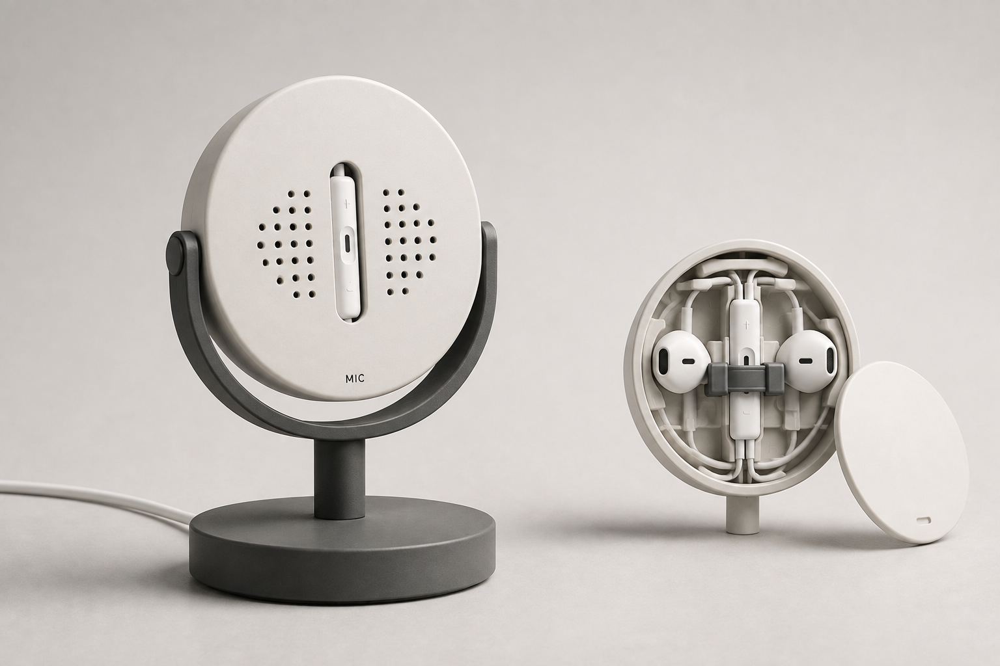

# EarPods 桌面麦克风支架

状态：本目录保存前期概念设计。后续任务的可打印模型已单独整理到 [EarPods 磁吸支架](../earpods-magnetic-stand/README.md)，模型状态与实测结果以该目录为准。

## 当前方案

用于收纳完整 Apple EarPods 有线耳机，并将线控麦克风暴露在外，服务于桌面语音输入。

用户最后确认采用低底座、短支柱和固定圆盘。不使用可旋转支架。圆盘中央露出线控收音面，内部滑闩固定线控；两个耳塞与电线收在内部。整体参考迪特·拉姆斯的简洁几何造型。

[最终完整提示词](prompts/fixed-disc-final.txt)是当前设计入口，可以复制给生图工具使用。它已从最后一版设计文本单独保存。

提示词中的圆盘直径约 70 mm、厚 25～30 mm，底座直径约 85 mm、厚 12 mm，支柱外露高约 40 mm，均为外观比例建议，尚未按耳机实测尺寸验证。

## 已有材料

- [历史概念图](archive/concepts/)：7 张原始生成图片。
- [历史提示词](archive/prompts/)：4 份当时保存的文本。
- [材料校验值](material_checksums.json)：原始图片与提示词的 SHA-256。

下面是最终修改前的拉姆斯风格概念图。图中仍有 U 形托架和侧轴，用户最后已要求取消；它只用来参考圆盘、颜色与整体风格，不代表最终结构。当前没有找到固定短支柱方案对应的新概念图。



## 建模前需确认

需要测量实际耳机线控的长宽厚、收音孔和按钮位置、耳塞轮廓及短支线长度。收音孔必须对外开放，滑闩不能压按钮，电线不能被拉紧或急折。应先制作线控夹持部分的试装件，再确定整机尺寸。

本目录只整理该任务现有材料，不包含新建模。原始材料保留原样，未导出聊天全文。来源任务 ID：`01a072a9-6fd0-78f3-8022-92124efbd7e3`。

在仓库根目录校验原始材料：

```bash
python3 - <<'PYCODE'
import hashlib, json
from pathlib import Path
root = Path('earpods-microphone-stand')
items = json.loads((root / 'material_checksums.json').read_text())
for item in items:
    path = root / item['file']
    assert hashlib.sha256(path.read_bytes()).hexdigest() == item['sha256'], path
print(f'{len(items)} 个原始材料文件校验通过')
PYCODE
```
