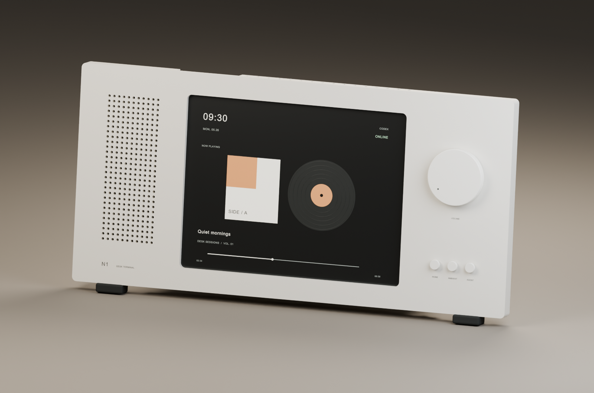

# Nokia N1 桌面外壳

当前使用 **V4**。主体与配件已由用户打印并试装通过；插销仍待实物反馈。尺寸单位为毫米。



## 文件入口

- [可编辑 Blender 模型](v4/n1_reference_v4.blend)及 [11 个零件 STL](v4/stl/)。
- [装配与结构说明](v4/README.md)。V4 正面与固定架必须配套使用。
- [P2S PLA 打印盘索引](v4/p2s_pla/README.md)。
- [插销规格与试插说明](v4/pins/README.md)。
- [历史方案](archive/README.md)：V3、早期 OpenSCAD 和对应设计说明。

## 当前打印盘

| 零件 | 文件 | 颜色与注意事项 |
| --- | --- | --- |
| 整块正面 | [正面盘](v4/p2s_pla/front/n1_v4_front_P2S_PLA.3mf) | 白色；保持工程中的竖印方向 |
| 固定架 | [固定架盘](v4/p2s_pla/gray_cradle/n1_v4_gray_cradle_P2S_PLA.3mf) | 灰色，需要支撑 |
| 两片顶部压片 | [原试装盘](v4/p2s_pla/fit_trial/n1_v4_fit_trial_P2S_PLA.3mf) | 白色；该盘还含固定架，只补压片时先移除固定架 |
| 旋钮与三个按钮 | [白色控制件盘](v4/p2s_pla/white_controls/n1_v4_white_controls_P2S_PLA.3mf) | 白色，无支撑 |
| 后支架与左右后盖 | [灰色背面零件盘](v4/p2s_pla/gray_rear_parts/n1_v4_gray_rear_parts_P2S_PLA.3mf) | 灰色，需要支撑 |
| 最新选择：2.6 mm 短销 × 8 | [8 根销打印盘](v4/pins/trial_2_6_x8/n1_pins_D2.60_x8_P2S_PLA.3mf) | 灰色，约 14.5 分钟、0.74 g，松紧尚未验证 |

8 根销的圆头以下长度均为 8 mm。它们是同一款短销的重复件，不是覆盖全部安装位置的整套销。其他位置所需长度见插销说明。

在 Bambu Studio 中打开 3MF，核对 P2S、0.4 mm 喷嘴、PLA 和实际耗材槽位，再预览切片。软件重新打开文件时曾套用本机默认参数；不要仅凭文件名判断支撑或墙数。3MF 中保留的切片结果和各目录的检查 JSON 可用于比对。预估用量和时间不等于实际打印记录。

## 编辑与检查

直接用 Blender 打开 `.blend` 编辑。建模脚本和导出脚本位于 `v4/`；新仓库中的脚本以自身目录为输出目录。脚本创建场景使用 macOS 的 Arial 字体。重建会覆盖该版本的场景与导出件，日常查看不需要重建。

如确实需要重新建模并导出，可在仓库根目录执行（macOS，已安装 Blender）：

```bash
/Applications/Blender.app/Contents/MacOS/Blender --background --python nokia-n1/v4/create_model.py --python nokia-n1/v4/validate_export.py
```

重建后需重新核对压片朝向和切片，不能把旧 3MF 当作更新后的模型。建模脚本并不复现之前在场景中进行的所有手动调整。

核对归档的模型和打印文件是否与整理时一致，在仓库根目录执行：

```bash
python3 - <<'PYCODE'
import hashlib, json
from pathlib import Path
root = Path('nokia-n1')
items = json.loads((root / 'material_checksums.json').read_text())
for item in items:
    path = root / item['file']
    assert hashlib.sha256(path.read_bytes()).hexdigest() == item['sha256'], path
print(f'{len(items)} 个材料文件校验通过')
PYCODE
```

归档校验只证明文件完整，不验证装配强度。后支架若使用塑料销后松动，应使用原设计的螺丝固定。
